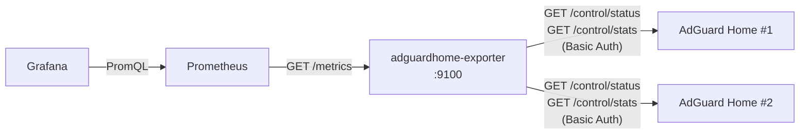

# AdGuard Home Prometheus Exporter

[](https://github.com/t0mer/AGHexporter/releases)
[](https://hub.docker.com/r/techblog/aghexporter)
[](go.mod)
[](LICENSE)

A single-binary Prometheus exporter for one or more [AdGuard Home](https://adguard.com/en/adguard-home/overview.html) instances. It exposes `/metrics` with all scraped data labelled by instance name, so a single exporter can serve every AdGuard Home server you run and the bundled Grafana dashboard can filter by instance.

It is meant for self-hosters who want AdGuard Home query, blocking, client, and upstream statistics in Prometheus and Grafana without running one exporter per DNS server.

## Table of Contents

- [Features](#features)
- [How It Works](#how-it-works)
- [Requirements](#requirements)
- [Installation](#installation)
- [Quick Start](#quick-start)
- [Configuration](#configuration)
- [Metrics Reference](#metrics-reference)
- [Prometheus Configuration](#prometheus-configuration)
- [Grafana Dashboard](#grafana-dashboard)
- [Service Mode](#service-mode)
- [Security Notes](#security-notes)
- [Troubleshooting](#troubleshooting)
- [Development](#development)
- [Contributing](#contributing)
- [License](#license)

---

## Features

- **Multi-instance** — scrape any number of AdGuard Home instances in a single process.
- **Parallel scraping** — each `/metrics` pull fans out one goroutine per instance, with a 10 s timeout per HTTP request; a failing instance never blocks or pollutes the others.
- **Three configuration formats** — indexed env vars (with secret-file support), CSV env vars, or repeatable CLI flags. All three can be mixed freely in one run.
- **Docker / Kubernetes secrets** — credentials can be read from files (`*_FILE` variables).
- **Exporter health metrics** — per-instance `adguard_up`, scrape duration, and a monotonic scrape-error counter.
- **Grafana dashboard included** — ready to import from [`deployments/grafana/dashboard.json`](deployments/grafana/dashboard.json).
- **OS service integration** — install, start, stop, restart, and uninstall as a system service via `--service`.
- **Single static binary** — no CGO, no runtime dependencies; the Docker image is built `FROM scratch`.
- **Multi-arch** — release binaries for Linux, macOS, and Windows; Docker images for `linux/amd64`, `linux/arm64`, and `linux/arm/v7`.
- **Graceful shutdown** — stops the HTTP server cleanly on `SIGINT`/`SIGTERM` (5 s grace period).

---

## How It Works



1. At startup the exporter collects instance definitions from env vars and `--instance` flags, validates them, and fails fast on any configuration error.
2. On every Prometheus scrape of `/metrics`, it queries each instance in parallel:
   - `GET <url>/control/status` → protection state
   - `GET <url>/control/stats` → query counters, processing time, and the top-N lists
3. Both requests use HTTP Basic Auth with the configured username and password.
4. Results are emitted as fresh const metrics labelled `instance="<name>"`. Nothing is cached between scrapes, so the data is only as old as your scrape interval.

---

## Requirements

- An AdGuard Home instance reachable over HTTP or HTTPS, and an account for its web interface (the exporter uses the `/control` API with Basic Auth).
- Prometheus to scrape the exporter; Grafana 10+ for the bundled dashboard (optional).
- Go 1.23+ **only** if you build from source.

---

## Installation

### Docker

The image is published on Docker Hub as [`techblog/aghexporter`](https://hub.docker.com/r/techblog/aghexporter) for `linux/amd64`, `linux/arm64`, and `linux/arm/v7`.

```bash
docker run -d --name adguard-exporter \
  -p 9100:9100 \
  -e ADGUARD_URL_1=http://192.168.1.1 \
  -e ADGUARD_USERNAME_1=admin \
  -e ADGUARD_PASSWORD_1=secret \
  --restart unless-stopped \
  techblog/aghexporter:latest
```

Tags: `latest` and the release version (`YYYY.M.PATCH`, e.g. `2026.5.0`).

### Docker Compose

```yaml
services:
  adguard-exporter:
    image: techblog/aghexporter:latest
    ports:
      - "9100:9100"
    environment:
      ADGUARD_URL_1: http://adguardhome:3000
      ADGUARD_USERNAME_1: admin
      ADGUARD_PASSWORD_1: secret
    restart: unless-stopped
```

With Docker secrets:

```yaml
services:
  adguard-exporter:
    image: techblog/aghexporter:latest
    ports:
      - "9100:9100"
    environment:
      ADGUARD_URL_1: http://adguardhome:3000
      ADGUARD_USERNAME_FILE_1: /run/secrets/adguard_username
      ADGUARD_PASSWORD_FILE_1: /run/secrets/adguard_password
    secrets:
      - adguard_username
      - adguard_password
    restart: unless-stopped

secrets:
  adguard_username:
    file: ./secrets/username.txt
  adguard_password:
    file: ./secrets/password.txt
```

Use the address and port where your AdGuard Home web interface listens (`http://adguardhome:3000` above assumes a Compose service named `adguardhome` on port 3000).

### Pre-built binaries

Download a binary for your platform from the [Releases](https://github.com/t0mer/AGHexporter/releases) page. Each release ships plain executables (no archive):

| OS      | Files |
|---------|-------|
| Linux   | `adguardhome-exporter-linux-amd64`, `-linux-arm64`, `-linux-armv7`, `-linux-armv6`, `-linux-386` |
| macOS   | `adguardhome-exporter-darwin-amd64` (Intel), `-darwin-arm64` (Apple Silicon) |
| Windows | `adguardhome-exporter-windows-amd64.exe`, `-windows-arm64.exe` |

```bash
curl -Lo adguardhome-exporter \
  https://github.com/t0mer/AGHexporter/releases/latest/download/adguardhome-exporter-linux-amd64
chmod +x adguardhome-exporter
./adguardhome-exporter --instance "url=http://192.168.1.1,username=admin,password=secret"
```

### `go install`

```bash
go install github.com/t0mer/AGHexporter/cmd/adguardhome-exporter@latest
```

Binaries built this way report version `dev` in the startup log.

### Build from source

```bash
git clone https://github.com/t0mer/AGHexporter.git
cd AGHexporter
make build          # → bin/adguardhome-exporter
```

See [Development](#development) for the other build targets.

---

## Quick Start

```bash
# Single instance via env vars
export ADGUARD_URL_1=http://192.168.1.1
export ADGUARD_USERNAME_1=admin
export ADGUARD_PASSWORD_1=secret
./bin/adguardhome-exporter

# Single instance via CLI flag
./bin/adguardhome-exporter \
  --instance "url=http://192.168.1.1,username=admin,password=secret,name=home"

# Two instances
./bin/adguardhome-exporter \
  --instance "url=http://192.168.1.1,username=admin,password=pass1,name=primary" \
  --instance "url=http://192.168.1.2,username=admin,password=pass2,name=secondary"
```

Metrics are available at `http://localhost:9100/metrics`. Visiting `/` (or any other path) redirects there automatically.

---

## Configuration

There is no config file: everything is set through CLI flags and environment variables.

### CLI flags

| Flag         | Default | Env override              | Description                                               |
|--------------|---------|---------------------------|-----------------------------------------------------------|
| `--port`     | `9100`  | `ADGUARD_EXPORTER_PORT`   | Port to expose `/metrics` on (listens on all interfaces). |
| `--instance` | —       | —                         | Inline instance spec (repeatable). See [Format C](#format-c----instance-cli-flag-repeatable). |
| `--service`  | —       | —                         | Service action: `install`, `uninstall`, `start`, `stop`, `restart`. See [Service Mode](#service-mode). |
| `--help`     | —       | —                         | Print usage and exit.                                     |

**Port precedence:** `ADGUARD_EXPORTER_PORT` → `--port` → built-in default `9100`. The env var always wins over the flag when it holds a valid positive integer; an invalid value is silently ignored.

### Environment variables (summary)

| Variable | Default | Description |
|----------|---------|-------------|
| `ADGUARD_EXPORTER_PORT` | — | Overrides `--port`. |
| `ADGUARD_URL_<N>` | — | Format A: instance URL. |
| `ADGUARD_NAME_<N>` | `host[:port]` of URL | Format A: instance label. |
| `ADGUARD_USERNAME_<N>` / `ADGUARD_USERNAME_FILE_<N>` | — | Format A: username, inline or from file. |
| `ADGUARD_PASSWORD_<N>` / `ADGUARD_PASSWORD_FILE_<N>` | — | Format A: password, inline or from file. |
| `ADGUARD_SKIP_TLS_<N>` | `true` | Format A: skip TLS certificate verification. |
| `ADGUARD_URLS` | — | Format B: comma-separated URLs. |
| `ADGUARD_USERNAMES` | — | Format B: comma-separated usernames. |
| `ADGUARD_PASSWORDS` | — | Format B: comma-separated passwords. |
| `ADGUARD_NAMES` | `host[:port]` of each URL | Format B: comma-separated instance labels. |
| `ADGUARD_SKIP_TLS` | `true` for each | Format B: comma-separated `true`/`false`. |

The per-format details follow.

### Instance configuration

All three formats can be mixed; instances are collected in the order **Format A → Format B → Format C**. They are additive — there is no precedence between formats.

After collecting all instances:

- Duplicate resolved names are a fatal error (set `ADGUARD_NAME_<N>` / `ADGUARD_NAMES` / `name=` to disambiguate).
- Every instance must end up with a URL (`http` or `https`), a username, and a password.
- Zero instances configured is a fatal error; the HTTP server will not start.

URLs are normalized: a trailing `/` is stripped and the scheme is lower-cased. When no name is given, the name defaults to the URL's `host[:port]` (e.g. `192.168.1.1` or `adguardhome:3000`).

---

#### Format A — Indexed env vars (recommended; supports secret files)

Per-instance variables suffixed with `_<N>` (1-based integer). Indices do not need to be contiguous; instances are ordered by index.

| Variable                    | Required | Description                                                      |
|-----------------------------|----------|------------------------------------------------------------------|
| `ADGUARD_URL_<N>`           | yes      | Instance URL (`http://` or `https://`).                          |
| `ADGUARD_NAME_<N>`          | no       | Display name / Prometheus label. Default: `host[:port]` from URL.|
| `ADGUARD_USERNAME_<N>`      | one of * | Inline username.                                                 |
| `ADGUARD_USERNAME_FILE_<N>` | one of * | Path to a file containing the username (trimmed).                |
| `ADGUARD_PASSWORD_<N>`      | one of † | Inline password.                                                 |
| `ADGUARD_PASSWORD_FILE_<N>` | one of † | Path to a file containing the password (trimmed).                |
| `ADGUARD_SKIP_TLS_<N>`      | no       | Skip TLS verification (`true`/`false`). Default: `true`. An unparseable value (e.g. `yes`) silently becomes `false`. |

\* Exactly one of `USERNAME` / `USERNAME_FILE` must be set. Setting both is a fatal error.<br>
† Exactly one of `PASSWORD` / `PASSWORD_FILE` must be set. Setting both is a fatal error.

**Inline credentials:**

```bash
ADGUARD_URL_1=http://192.168.1.1
ADGUARD_USERNAME_1=admin
ADGUARD_PASSWORD_1=secret
ADGUARD_NAME_1=home-primary

ADGUARD_URL_2=https://192.168.1.2
ADGUARD_USERNAME_2=admin
ADGUARD_PASSWORD_2=secret2
ADGUARD_SKIP_TLS_2=false
```

**Secret files (Docker secrets / Kubernetes secrets):**

```bash
ADGUARD_URL_1=http://192.168.1.1
ADGUARD_USERNAME_FILE_1=/run/secrets/adguard_username
ADGUARD_PASSWORD_FILE_1=/run/secrets/adguard_password
```

Secret file contents are read once at startup, whitespace-trimmed, and never logged. Rotating a secret requires restarting the exporter.

---

#### Format B — CSV env vars

Parallel comma-separated arrays. All arrays must have the same number of entries. Whitespace around each entry is trimmed.

| Variable             | Required | Description                                                     |
|----------------------|----------|-----------------------------------------------------------------|
| `ADGUARD_URLS`       | yes      | Comma-separated list of instance URLs.                          |
| `ADGUARD_USERNAMES`  | yes      | Comma-separated usernames (same count as `ADGUARD_URLS`).       |
| `ADGUARD_PASSWORDS`  | yes      | Comma-separated passwords (same count as `ADGUARD_URLS`).       |
| `ADGUARD_NAMES`      | no       | Comma-separated display names. Default: `host[:port]` per URL.  |
| `ADGUARD_SKIP_TLS`   | no       | Comma-separated `true`/`false`. Default: `true` per instance. An unparseable value (e.g. `yes`) silently becomes `false`. |

```bash
ADGUARD_URLS=http://192.168.1.1,http://192.168.1.2
ADGUARD_USERNAMES=admin,admin
ADGUARD_PASSWORDS=pass1,pass2
ADGUARD_NAMES=primary,secondary
```

Length mismatches between arrays are a fatal error. Secret files are not supported in Format B, and values cannot contain commas.

---

#### Format C — `--instance` CLI flag (repeatable)

Comma-separated `key=value` pairs. Repeat the flag for multiple instances.

```bash
./bin/adguardhome-exporter \
  --instance "url=http://192.168.1.1,username=admin,password=pass1,name=primary" \
  --instance "url=http://192.168.1.2,username=admin,password=pass2,name=secondary,skip_tls=false"
```

| Key             | Required | Description |
|-----------------|----------|-------------|
| `url`           | yes      | Instance URL (`http://` or `https://`). |
| `username`      | one of * | Inline username. |
| `username_file` | one of * | Path to a file containing the username (trimmed). |
| `password`      | one of † | Inline password. |
| `password_file` | one of † | Path to a file containing the password (trimmed). |
| `name`          | no       | Display name / Prometheus label. Default: `host[:port]` from URL. |
| `skip_tls`      | no       | Skip TLS verification (`true`/`false`). Default: `true`. An unparseable value (e.g. `yes`) silently becomes `false`. |

Same mutual-exclusion rules apply: setting both `username` and `username_file` (or both password variants) on the same flag is a fatal error. Because pairs are split on `,` (each pair is split only on its first `=`), values containing a comma cannot be passed this way — use Format A instead.

---

## Metrics Reference

All metrics carry the label `instance="<name>"`. Top-N metrics add one more label.

### Scalar metrics

| Metric                               | Type    | Description                                                    |
|--------------------------------------|---------|----------------------------------------------------------------|
| `adguard_up`                         | Gauge   | `1` if the instance is reachable, `0` if the scrape failed.    |
| `adguard_protection_enabled`         | Gauge   | `1` if DNS protection is enabled, `0` otherwise.               |
| `adguard_dns_queries_total`          | Gauge   | Total DNS queries in the current stats window.                 |
| `adguard_blocked_filtering_total`    | Gauge   | Queries blocked by filter lists.                               |
| `adguard_blocked_safebrowsing_total` | Gauge   | Queries blocked by safe browsing (malware/phishing).           |
| `adguard_blocked_parental_total`     | Gauge   | Queries blocked by parental controls.                          |
| `adguard_enforced_safesearch_total`  | Gauge   | Queries with safe search enforced.                             |
| `adguard_avg_processing_time_seconds`| Gauge   | Average DNS processing time in seconds.                        |
| `adguard_scrape_duration_seconds`    | Gauge   | Time taken to scrape this instance.                            |
| `adguard_scrape_errors_total`        | Counter | Total failed scrapes since process start (monotonic).          |

> The AdGuard Home "total" fields are exposed as **gauges** because AdGuard Home returns rolling-window values
> that can decrease over time. Using a counter for them would break `rate()` in Prometheus.
> `adguard_scrape_errors_total` is the only true counter — it is generated by the exporter and is
> always monotonically increasing.

When an instance cannot be scraped (network error, non-200 response, or invalid JSON from either endpoint), only `adguard_up` (= `0`), `adguard_scrape_errors_total`, and `adguard_scrape_duration_seconds` are emitted for it.

### Top-N metrics

Per-entry gauges with an additional label. The exporter emits whatever the AdGuard Home API returns — no artificial limit is applied.

| Metric                                  | Extra label | Type  | Description                              |
|-----------------------------------------|-------------|-------|------------------------------------------|
| `adguard_top_clients`                   | `client`    | Gauge | DNS queries from top clients.            |
| `adguard_top_queried_domains`           | `domain`    | Gauge | Most queried domains.                    |
| `adguard_top_blocked_domains`           | `domain`    | Gauge | Most blocked domains.                    |
| `adguard_top_upstreams`                 | `upstream`  | Gauge | Responses per upstream DNS server.       |
| `adguard_top_upstreams_avg_time_seconds`| `upstream`  | Gauge | Average response time per upstream (s).  |

Top-N entries are regenerated fresh on every scrape — stale entries never linger in the output.

### Source API fields

| Metric | AdGuard Home API field |
|--------|------------------------|
| `adguard_protection_enabled` | `/control/status` → `protection_enabled` |
| `adguard_dns_queries_total` | `/control/stats` → `num_dns_queries` |
| `adguard_blocked_filtering_total` | `/control/stats` → `num_blocked_filtering` |
| `adguard_blocked_safebrowsing_total` | `/control/stats` → `num_replaced_safebrowsing` |
| `adguard_blocked_parental_total` | `/control/stats` → `num_replaced_parental` |
| `adguard_enforced_safesearch_total` | `/control/stats` → `num_replaced_safesearch` |
| `adguard_avg_processing_time_seconds` | `/control/stats` → `avg_processing_time` |
| `adguard_top_clients` | `/control/stats` → `top_clients` |
| `adguard_top_queried_domains` | `/control/stats` → `top_queried_domains` |
| `adguard_top_blocked_domains` | `/control/stats` → `top_blocked_domains` |
| `adguard_top_upstreams` | `/control/stats` → `top_upstreams_responses` |
| `adguard_top_upstreams_avg_time_seconds` | `/control/stats` → `top_upstreams_avg_time` |

### Example output

```text
adguard_up{instance="primary"} 1
adguard_protection_enabled{instance="primary"} 1
adguard_dns_queries_total{instance="primary"} 123456
adguard_top_blocked_domains{domain="ads.example.com",instance="primary"} 842
adguard_top_upstreams_avg_time_seconds{instance="primary",upstream="1.1.1.1:53"} 0.012
adguard_scrape_errors_total{instance="primary"} 0
```

(Values are illustrative.)

---

## Prometheus Configuration

Add a scrape job to your `prometheus.yml`. The `honor_labels: true` setting is **required** — without it Prometheus overwrites the `instance` label (which carries the AdGuard Home instance name) with the exporter's own scrape address, breaking the per-instance filtering in the dashboard.

```yaml
scrape_configs:
  - job_name: adguardhome
    honor_labels: true          # keep the instance labels set by the exporter
    scrape_interval: 30s
    static_configs:
      - targets: ["localhost:9100"]
```

If you are running the exporter on a different host or behind a reverse proxy, replace `localhost:9100` with the appropriate address. The `job_name` value (`adguardhome` above) is what appears in the **Job** drop-down of the Grafana dashboard.

Each scrape triggers live API calls to every AdGuard Home instance, so avoid very short scrape intervals. Each instance makes two sequential requests (`/control/status`, then `/control/stats`), each with its own 10 s timeout, so one slow instance can take about 20 s. Set `scrape_timeout` above ~20 s if your instances are slow (the exporter's HTTP write timeout is 30 s).

A simple alerting rule on exporter health:

```yaml
groups:
  - name: adguardhome
    rules:
      - alert: AdGuardHomeDown
        expr: adguard_up == 0
        for: 5m
        labels:
          severity: warning
        annotations:
          summary: "AdGuard Home instance {{ $labels.instance }} is unreachable"
```

---

## Grafana Dashboard

### Import

1. In Grafana, go to **Dashboards → Import**.
2. Upload [`deployments/grafana/dashboard.json`](deployments/grafana/dashboard.json) from this repository (or paste its contents).
3. When prompted, select your **Prometheus** data source. The dashboard uses Grafana's standard `__inputs` mechanism, so this prompt appears exactly once at import — no data source drop-down is shown on the dashboard itself.
4. Click **Import**.

The dashboard targets Grafana 10.0 or later and exposes two variables in the top bar:

| Variable | Description |
|----------|-------------|
| **Job** | Prometheus scrape job name (e.g. `adguardhome`). |
| **Instance** | One or more AdGuard Home instance names to display. Supports multi-select; default is **All**. |

Panels include status and protection state, queries and blocked queries in range, blocked percentage, filtering reasons, processing time, per-upstream latency, top clients, top queried and blocked hosts, and exporter health (scrape duration and scrape errors).

### Screenshots

**Full dashboard:**


**Status, filtering breakdown, and top clients:**


**Average response time, query volume, upstream latency, and blocked query rate:**


**Top queried hosts, top blocked hosts, and top filtered clients:**


---

## Service Mode

Install the exporter as a system service (via [`kardianos/service`](https://github.com/kardianos/service): systemd, launchd, and others) so it starts automatically with the OS.

```bash
# Install (captures current ADGUARD_* env vars and flags into the service definition)
sudo ADGUARD_URL_1=http://192.168.1.1 \
     ADGUARD_USERNAME_1=admin \
     ADGUARD_PASSWORD_1=secret \
     ./bin/adguardhome-exporter --service install

# Start / stop / restart
sudo ./bin/adguardhome-exporter --service start
sudo ./bin/adguardhome-exporter --service stop
sudo ./bin/adguardhome-exporter --service restart

# Remove
sudo ./bin/adguardhome-exporter --service uninstall
```

At install time, all `ADGUARD_*` environment variables present in the current shell (including `ADGUARD_EXPORTER_PORT`) are captured into the service definition (`Environment=` lines in the systemd unit). Any `--instance` flags, and `--port` when it differs from `9100`, are also preserved as service arguments. The service therefore has its full configuration available when the OS starts it — no additional setup required.

Note that `sudo` resets most environment variables, which is why the example passes them on the `sudo` command line. Re-run `--service install` (after `uninstall`) to change the configuration.

**Windows service mode is not supported.** The service's start/stop hooks are no-ops and the binary never hands control to the service manager, so starting it through the Windows Service Control Manager is expected to time out (error 1053). systemd and launchd work because they simply run the binary.

Service metadata:
- **Name:** `adguardhome-exporter`
- **Display name:** `AdGuard Home Prometheus Exporter`
- **Description:** `Scrapes one or more AdGuard Home instances and exposes Prometheus metrics.`

---

## Security Notes

- **TLS verification is skipped by default** (`skip_tls` defaults to `true`) so that self-signed AdGuard Home certificates work out of the box. For instances with valid certificates, set `ADGUARD_SKIP_TLS_<N>=false` / `skip_tls=false`. Any value that is not a valid boolean (e.g. `yes`) is silently treated as `false`, which turns verification **on**. The Docker image includes the system CA bundle for verified HTTPS.
- **Prefer secret files** (`ADGUARD_USERNAME_FILE_<N>` / `ADGUARD_PASSWORD_FILE_<N>`) over inline passwords. Inline values in `--instance` flags are visible in the process list, and inline env vars are visible to anyone who can inspect the container or process environment.
- **Service mode stores credentials in plain text** in the service definition (for example the systemd unit file), because the `ADGUARD_*` variables are copied into it. Protect that file accordingly, or use `*_FILE` variables so only file paths are stored.
- **`/metrics` has no authentication** and listens on all interfaces. It exposes client IPs/names and queried domains from your network, so restrict access with a firewall or bind it to a private network.
- Use a dedicated AdGuard Home account for the exporter if possible. Credentials are sent with HTTP Basic Auth, so prefer `https://` URLs when the exporter and AdGuard Home are on different hosts.

---

## Troubleshooting

| Symptom | Likely cause |
|---------|--------------|
| Exits with `no instances configured` | No `ADGUARD_URL_<N>`, `ADGUARD_URLS`, or `--instance` was provided (check that variables are actually exported / passed to the container). |
| Exits with `duplicate instance name` | Two instances resolved to the same name — often the same host in two formats. Set explicit names. |
| Exits with `username is required` / `password is required` | An instance is missing credentials, or a secret file is empty. |
| Exits with `both ... are set ...; use exactly one` | Both the inline and the `_FILE` form of a credential are set. |
| `adguard_up` is `0` and the log shows `scrape failed` | Instance unreachable, wrong URL/port, or wrong credentials (`unexpected HTTP status 401`). The URL must point to the AdGuard Home web interface, without the `/control` suffix. |
| HTTPS scrape fails with a certificate error | `skip_tls` is `false` and the certificate is self-signed or not trusted. |
| Certificate error although you meant to skip verification | The `skip_tls` value is not a valid boolean (e.g. `yes`, `on`) and was treated as `false`. Use `true`. |
| Grafana shows the exporter address instead of instance names | `honor_labels: true` is missing from the Prometheus scrape job. |
| Port change via `--port` has no effect | `ADGUARD_EXPORTER_PORT` is set and takes precedence. |
| Credentials with a comma fail in Format B/C | Values are split on commas; use Format A. |

Logs go to stderr via Go's default `log/slog` logger (INFO and above), e.g. `2026/09/28 21:54:00 INFO starting AdGuard Home exporter version=… port=9100 instances=1`.

---

## Development

```bash
make build          # → bin/adguardhome-exporter (version "dev")
make test           # go test ./...
make lint           # golangci-lint run (requires golangci-lint)
make run            # go run against http://localhost with sample credentials
make release        # cross-compile all targets into dist/ (scripts/build.sh)
make clean          # remove bin/ and dist/
```

`make release` runs [`scripts/build.sh`](scripts/build.sh), which builds with `CGO_ENABLED=0` and `-trimpath -ldflags "-s -w -X main.version=$VERSION"` for:

`linux-amd64`, `linux-arm64`, `linux-386`, `linux-armv6`, `linux-armv7`, `darwin-amd64`, `darwin-arm64`, `windows-amd64.exe`, `windows-arm64.exe`.

Set `VERSION` to embed a version string (`VERSION=2026.5.0 make release`); it defaults to `dev`. Releases use calendar versioning (`YYYY.M.PATCH`), computed by [`scripts/next-version.sh`](scripts/next-version.sh).

Build the Docker image locally:

```bash
docker build --build-arg VERSION=dev -t aghexporter:dev .
```

### Project layout

```
cmd/adguardhome-exporter/   # main package: flag parsing and wiring
internal/adguard/           # AdGuard Home API client (/control/status, /control/stats)
internal/collector/         # Prometheus collector and metric descriptors
internal/instances/         # instance discovery (Formats A/B/C), secret files, validation
internal/server/            # HTTP server (/metrics, redirect, graceful shutdown)
internal/svc/               # OS service install/start/stop via kardianos/service
deployments/grafana/        # Grafana dashboard JSON
scripts/                    # build.sh, next-version.sh
.github/workflows/          # release.yml, docker.yml, publish-ghcr.yml
```

### CI / release workflows

- **Release** (`release.yml`, manual) — computes the version, cross-compiles all binaries, tags the commit, and creates a GitHub Release.
- **Docker** (`docker.yml`) — runs after a successful Release (or manually) and pushes the multi-arch image to Docker Hub with `latest` and version tags.
- **Publish to GHCR** (`publish-ghcr.yml`, manual) — pushes the image to `ghcr.io/t0mer/aghexporter`.

---

## Contributing

Issues and pull requests are welcome at [github.com/t0mer/AGHexporter](https://github.com/t0mer/AGHexporter). Please run `make test` and `make lint` before opening a pull request, and keep one logical change per commit.

---

## License

Licensed under the Apache License 2.0. See [LICENSE](LICENSE).
